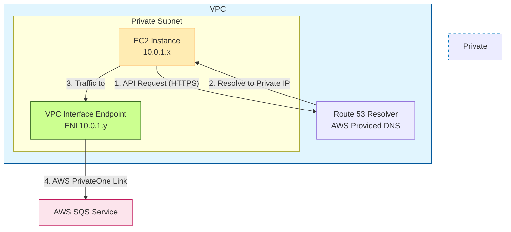

# 專案簡介
本專案演示如何透過 VPC Interface Endpoint 在私有子網 (Private Subnet) 內與 AWS SQS 進行安全通訊。

## 架構設計
資源部署於 VPC (10.0.0.0/16) 內的特定 Private Subnet。運算資源 (如 EC2) 發出的 SQS API 請求，透過 AWS 內部 DNS 解析為 VPC Interface Endpoint 的私有 IP。流量經由 Route Table 導向 Endpoint ENI，透過 AWS 骨幹網路連線至 SQS，確保數據不經過公網。

## 架構圖


## 先決條件 (Prerequisites)
- AWS CLI 已安裝並設定。
- Terraform v1.0.0+。
- 具有部署 VPC, EC2, IAM, SQS 權限的 AWS 帳號。

## 變數 (Variables)
| 名稱 | 描述 | 預設值 |
|------|------|--------|
| `project_name` | 專案名稱，用於資源命名 | `production-system` |
| `environment` | 部署環境 (dev, staging, prod) | `dev` |
| `vpc_cidr` | VPC 的 CIDR 區塊 | `10.0.0.0/16` |

## 輸出 (Outputs)
- `sqs_queue_url`: 部署完成後的 SQS Queue URL。


## 關於驗證資源 (verify.tf)
本專案包含一個 `verify.tf` 檔案，其用途為**自動搭建測試環境**。若移除此檔案，部署後將僅會有網路與 SQS 端點，缺乏執行測試指令的運算資源。

`verify.tf` 會建立以下暫時性資源：
- **Test EC2**: 位於私有子網，用於登入並執行測試指令。
- **IAM Role**: 賦予 EC2 存取 SQS 與 SSM 的權限。
- **SSM VPC Endpoints**: 讓您能透過 AWS Console (Session Manager) 連線到沒有公網 IP 的私有 EC2。

**使用方式**：
1. **保留**此檔案進行初次部署 (`terraform apply`)，以執行下方的驗證步驟。
2. 驗證完成後，可**移除**此檔案並再次部署，以清除測試資源，僅保留核心架構。

## 使用說明
1. 初始化並檢視計畫：
   ```bash
   terraform init
   terraform plan
   ```
2. 執行部署：
   ```bash
   terraform apply
   ```

## 驗證步驟 (Verification)

### 步驟 1：連線到私有 EC2
1. 登入 AWS Console，前往 EC2 頁面。
2. 選中名為 `<project_name>-<environment>-test-vm` 的實例。
3. 點擊 **Connect** -> **Session Manager** -> **Connect**。
4. 成功連線代表 SSM Endpoint 運作正常，且 Private Subnet 網路設定正確。

### 步驟 2：驗證 DNS 解析 (Private DNS Check)
確認 SQS 網域名稱解析為私有 IP (10.0.x.x)，而非公網 IP。
```bash
python3 -c "import socket; print(socket.gethostbyname('sqs.ap-northeast-1.amazonaws.com'))"
```
- **預期結果**：10.0.1.x (VPC 網段內的 IP)。
- **錯誤結果**：52.x.x.x (公網 IP)，表示 Endpoint 的 `private_dns_enabled` 未生效。

### 步驟 3：驗證 SQS 存取 (功能測試)
使用 AWS CLI 測試訊息發送與接收。

#### 取得 Queue URL
```bash
# 也可直接複製 terraform output 輸出的網址
QUEUE_URL=$(aws sqs get-queue-url --queue-name production-system-dev-queue --output text)
```

#### 發送訊息
```bash
aws sqs send-message --queue-url $QUEUE_URL --message-body "Hello from Private Subnet!" --region ap-northeast-1
```
- **預期結果**：回傳 JSON 包含 `MessageId` 和 `MD5`。

#### 接收訊息
```bash
aws sqs receive-message --queue-url $QUEUE_URL --region ap-northeast-1
```
- **預期結果**：顯示剛才發送的 "Hello from Private Subnet!" 訊息內容。

### 驗證完成後的清理
驗證成功後，若要刪除測試資源（EC2, IAM, SSM Endpoints）僅保留核心架構：
1. 移除 `verify.tf` 檔案。
2. 再次執行 `terraform apply`。
