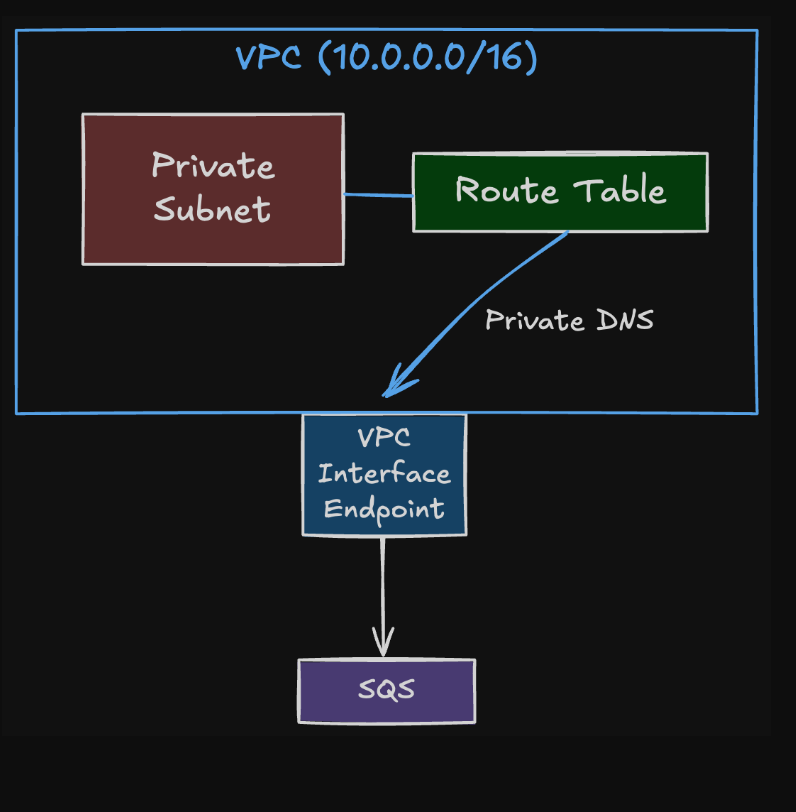

# 專案簡介
按照架構圖設計
位於VPC(10.0.0.0/16)內, 部署在特定Private Subnet中的運算資源(EC2, Lambda, etc)發送SQS API請求, DNS 查詢被解析為 VPC Interface Endpoint 的私有 IP, 
流量依據 Route Table 導向 Endpoint ENI, Interface Endpoint 透過 AWS 內部網路連線到 SQS, 成功透過SQS API將訊息送入SQS queue或者從SQS queue接收訊息

# 使用說明
1. 執行terraform init, terraform plan, terraform apply看執行結果

# 驗證步驟:
步驟 1：連線到私有 EC2
登入 AWS Console，前往 EC2 頁面。
選中名為 production-system-test-vm 的實例。

點擊上方 Connect (連線) 按鈕。
選擇 Session Manager 分頁，點擊 Connect。
成功代表：SSM Endpoint 運作正常，且您的 Private Subnet 網路是通的。

步驟 2：驗證 DNS 解析 (Private DNS Check)
在終端機視窗中，我們要確認 SQS 的網域名稱是否解析為「私有 IP」(10.0.x.x)，而非公網 IP。
python3 -c "import socket; print(socket.gethostbyname('sqs.ap-northeast-1.amazonaws.com'))"
預期結果：應顯示 10.0.1.x (或是您 VPC 網段內的 IP)。
錯誤結果：如果顯示 52.x.x.x (公網 IP)，代表 VPC Endpoint 的 private_dns_enabled 設定未生效。

步驟 3：驗證 SQS 存取 (功能測試)
使用 AWS CLI 發送與接收訊息。將 <SQS_URL> 替換為 Terraform output 顯示的網址。
### 取得 Queue URL (自動帶入環境變數或是手動複製)
QUEUE_URL=$(aws sqs get-queue-url --queue-name production-system-queue --output text)

### 發送訊息
aws sqs send-message --queue-url $QUEUE_URL --message-body "Hello from Private Subnet!" --region ap-northeast-1
預期結果：回傳 JSON 格式的 MessageId 和 MD5。

### 接收訊息：
aws sqs receive-message --queue-url $QUEUE_URL --region ap-northeast-1
預期結果：顯示剛才發送的 Hello from Private Subnet! 訊息內容。

### 驗證完成後的清理
驗證成功後，您可以直接刪除 verify.tf 檔案，然後再次執行 terraform apply，Terraform 就會幫您把這台測試用的 EC2、IAM Role 以及 SSM Endpoints 移除，只保留核心的業務架構。

# 架構圖

